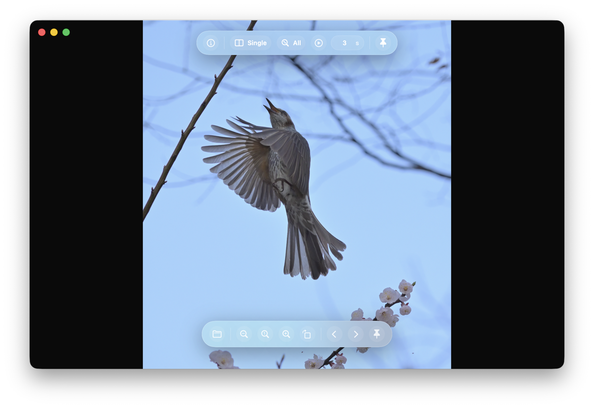
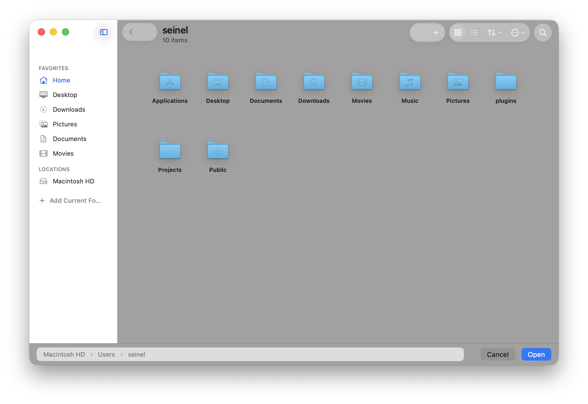

# Viewooa

[한국어 README](README.ko.md)

Viewooa is a native macOS photo viewer. It pairs with 자체파인더, a Finder-class visual file browser, so photo viewing and file browsing can evolve as separate apps while still feeling connected.



## What You Can Do

- Open images, folders, PDFs, and supported camera RAW files.
- Browse a folder with previous/next buttons, arrow keys, trackpad gestures, or mouse wheel navigation.
- View images as a single page, L-R spread, R-L spread, cover spread, or vertical webtoon-style strip.
- Fit images by all, width, or height, then zoom to actual size or custom zoom levels.
- Zoom with pinch gestures, Command + mouse wheel, toolbar controls, or double-click.
- Pan oversized images by dragging when the image is larger than the window.
- Rotate images, show metadata, and toggle lightweight post-processing options.
- Run a slideshow, including vertical scrolling playback for webtoon-style viewing.
- Open 자체파인더 from the viewer to pick another file or folder without leaving the app.

## 자체파인더

자체파인더 is the project's Finder-inspired browser for opening folders and files with familiar macOS behavior.



자체파인더 supports:

- Sidebar shortcuts for favorites and locations.
- Icon and list browsing modes.
- Back and forward navigation.
- Search with an expanding search field.
- Thumbnail size controls.
- Selection, Select All, Shift range selection, and blank-space drag selection.
- Finder-like path breadcrumbs with icons, including the selected file as the final segment.
- Browsing folders in 자체파인더 and opening files from the standalone browser app.

## Viewer Controls

The viewer uses floating glass-style controls so the photo stays central.

- Top bar: info, page layout, fit mode, slideshow, and toolbar pinning.
- Bottom bar: open 자체파인더, zoom out, actual size, zoom in, rotate, previous, next, and pinning.
- Hidden toolbars can appear when the pointer moves near them.
- Pinned toolbars stay visible and remember their last state.

## Supported Files

Viewooa focuses on common image workflows:

- Standard image formats supported by macOS, such as JPEG, PNG, HEIC, TIFF, GIF, BMP, and WebP where available.
- PDF files when opened directly.
- Camera RAW formats supported by macOS Uniform Type Identifiers, including major camera makers such as Canon, Nikon, Sony, Fujifilm, Panasonic, Olympus / OM System, Leica, Pentax, and others supported by the system.

PDF files are opened only when selected directly. They are not mixed into normal folder image browsing.

## Run

Double-click:

```text
Open Viewooa.command
```

Or run from Terminal:

```bash
./script/build_and_run.sh
```

## Notes

Viewooa and 자체파인더 are still evolving. The current focus is a smooth macOS photo viewer, a Finder-class browser, and safe file browsing behavior without hidden destructive actions.
